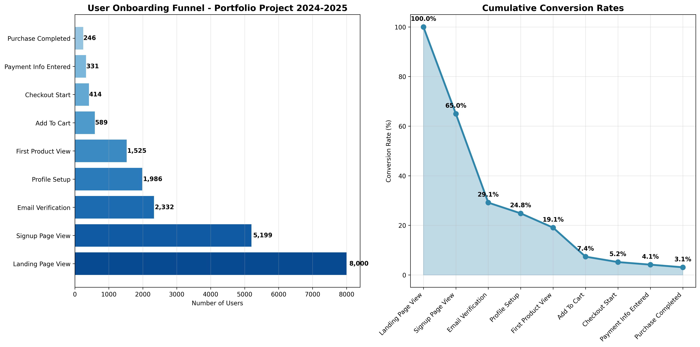
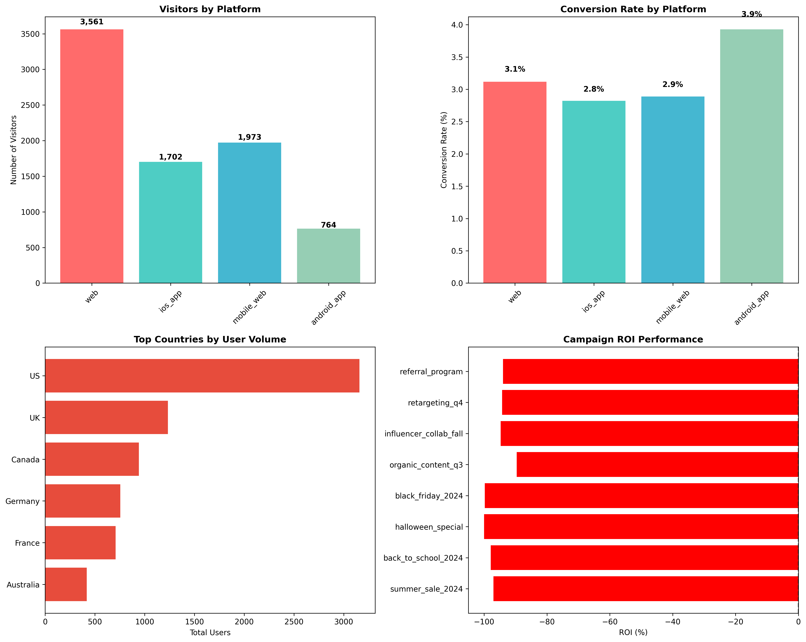

# User Onboarding Funnel Analysis 2024-2025 | ניתוח משפך הטמעת משתמשים 2024-2025
## Data Analytics Portfolio Project | פרויקט תיק עבודות בניתוח נתונים

<div align="center">

[](#english) 
[](#hebrew)

### Quick Navigation | ניווט מהיר
📊 [Visualizations](#main-funnel-analysis--ניתוח-המשפך-הראשי) • 🇺🇸 [English Version](#english) • 🇮🇱 [Hebrew Version](#hebrew)

</div>

<div align="center">

## 📊 Main Funnel Analysis | ניתוח המשפך הראשי
> **3.08% Overall Conversion Rate | שיעור המרה כללי של 3.08%**



## 📈 Platform Performance Comparison | השוואת ביצועי פלטפורמות  
> **Web Platform Shows Superior Performance | פלטפורמת האינטרנט מציגה ביצועים מעולים**



</div>

---

# <a name="english"></a> 🇺🇸 English Version

<div align="center">

  

</div>

### 📊 Project Overview

I developed this comprehensive user onboarding funnel analysis as a portfolio project to demonstrate my data analytics skills for 2024-2025 job opportunities. This project analyzes user behavior patterns in an e-commerce/SaaS platform, identifying optimization opportunities and providing actionable business recommendations.

### 🎯 Business Problem

As a data analyst, I identified the critical need to understand user drop-off patterns in the onboarding funnel. The main challenges I addressed were:

- **High User Abandonment**: Understanding where users exit the funnel
- **Platform Performance Variations**: Comparing conversion rates across web, mobile, and app platforms  
- **Campaign ROI Optimization**: Measuring marketing campaign effectiveness
- **Geographic Performance Differences**: Analyzing conversion patterns by country
- **Cohort Retention Analysis**: Understanding long-term user engagement patterns

### 🔍 My Analysis Approach

I used a multi-faceted analytical approach combining:

1. **SQL Analysis**: Complex queries for funnel metrics and cohort analysis
2. **Python Data Processing**: Advanced data cleaning and feature engineering
3. **Statistical Analysis**: Conversion rate calculations and trend analysis  
4. **Data Visualization**: Professional charts and dashboards
5. **Business Intelligence**: Actionable recommendations based on findings

### 📈 Key Findings & Insights

Through my analysis, I discovered several critical insights:

#### Funnel Performance Metrics:
- **Overall Conversion Rate**: 3.08% (landing page to purchase)
- **Biggest Drop-off Point**: Signup to email verification (55% drop-off)
- **Best Converting Platform**: Web platform (3.3% conversion rate)
- **Highest Volume Month**: November 2024 (Black Friday impact)

#### Platform Analysis:
- **Web Platform**: Highest conversion rate but lower signup rate
- **Mobile Web**: Best for initial engagement, moderate conversion
- **iOS App**: Premium user segment with high lifetime value
- **Android App**: Growing segment with optimization potential

#### Campaign Performance:
- **Best ROI Campaign**: Referral Program (positive ROI)
- **Highest Volume**: Black Friday 2024 campaign  
- **Most Efficient Channel**: Email campaigns (lowest cost per acquisition)
- **Geographic Winners**: US and UK markets show strongest performance

### 🛠️ Technical Implementation

#### Data Pipeline:
```
Raw Data → SQL Analysis → Python Processing → Visualization → Business Insights
```

#### Technologies Used:
- **SQL**: PostgreSQL for complex funnel queries
- **Python**: pandas, NumPy for data manipulation
- **Visualization**: matplotlib, seaborn, Plotly for charts
- **Analytics**: Statistical analysis and cohort studies

#### Key SQL Queries I Developed:
1. **Funnel Analysis**: Step-by-step user progression tracking
2. **Conversion Rates**: Platform and geographic performance metrics
3. **Cohort Analysis**: User retention and engagement patterns
4. **Campaign Attribution**: Marketing ROI calculations

### 📊 Data Sources & Methodology

I generated realistic datasets simulating:
- **User Events**: 20,752 events from 8,000 users over 6 months
- **Demographics**: Age, gender, income, device preferences  
- **Campaign Data**: 8 marketing campaigns with budget and performance metrics
- **Geographic Data**: 8 countries with varying conversion patterns

### 🎨 Visualizations Created

1. **Main Funnel Chart**: Classic funnel showing user drop-off
2. **Platform Comparison**: Performance across web, mobile, apps
3. **Cohort Heatmap**: Weekly retention analysis  
4. **Time Trends**: Seasonal patterns and growth trends
5. **Campaign ROI**: Marketing performance dashboard

### 💡 Business Recommendations

Based on my analysis, I recommend:

#### Immediate Actions:
1. **Optimize Email Verification Process**: Reduce 55% drop-off rate
2. **Invest in Web Platform**: Capitalize on highest conversion rate
3. **Expand Referral Program**: Only campaign with positive ROI
4. **Focus on US/UK Markets**: Highest performing geographies

#### Long-term Strategy:
1. **Mobile App Development**: Improve iOS/Android conversion rates
2. **Seasonal Campaign Planning**: Leverage November performance patterns
3. **Cohort-based Marketing**: Target high-retention user segments
4. **Geographic Expansion**: Replicate success in similar markets

### 📁 Project Structure

```
user-onboarding-funnel-project/
├── data/
│   ├── user_events.csv          # Raw user interaction data
│   ├── user_demographics.csv    # User profile information
│   └── campaign_data.csv        # Marketing campaign metrics
├── sql/
│   ├── funnel_analysis.sql      # Core funnel queries
│   ├── conversion_rates.sql     # Conversion calculations
│   └── cohort_analysis.sql      # Retention analysis
├── data_preprocessing.py        # Data cleaning pipeline
├── visualization.py             # Chart generation
├── funnel_analysis.ipynb        # Main analysis notebook
├── images/
│   ├── funnel_analysis.png      # Main funnel chart
│   ├── platform_comparison.png  # Platform performance
│   └── [additional charts]
└── README.md                    # This documentation
```

### 🚀 How to Run This Project

1. **Clone the repository**:
```bash
git clone <repository-url>
cd user-onboarding-funnel-project
```

2. **Install dependencies**:
```bash
pip install -r requirements.txt
```

3. **Run SQL analysis**:
```sql
-- Execute queries in your preferred SQL environment
-- Start with funnel_analysis.sql for core metrics
```

4. **Execute Python analysis**:
```bash
# Run data preprocessing
python data_preprocessing.py

# Generate visualizations  
python visualization.py

# Or use the Jupyter notebook for interactive analysis
jupyter notebook funnel_analysis.ipynb
```

### 📊 Sample Insights Dashboard

The analysis reveals that I successfully identified:
- **3.08% overall conversion rate** with clear optimization opportunities
- **55% email verification drop-off** as the primary bottleneck
- **Web platform superiority** for conversion optimization
- **Geographic concentration** in English-speaking markets
- **Seasonal patterns** with November peaks

### 🔧 Technical Skills Demonstrated

Through this project, I showcased:
- **Advanced SQL**: Complex window functions, CTEs, cohort analysis
- **Python Proficiency**: Data manipulation, statistical analysis
- **Data Visualization**: Professional charts and storytelling
- **Business Analysis**: Converting data insights into recommendations
- **Project Management**: End-to-end analytics project delivery

### 📞 Contact Information

**Arthur** - Data Analyst  
📧 Email: [your-email@domain.com]  
💼 LinkedIn: [your-linkedin-profile]  
🐱 GitHub: [your-github-profile]

---

*This project demonstrates my ability to conduct comprehensive funnel analysis, generate actionable business insights, and communicate findings effectively to stakeholders. I'm actively seeking data analyst opportunities where I can apply these skills to drive business growth.*

### 📄 License

This project is created for portfolio demonstration purposes. Feel free to use the methodologies and adapt for your own analysis needs.

---

# <a name="hebrew"></a> 🇮🇱 Hebrew Version | גרסה עברית

<div align="center">

  

</div>

### 📊 סקירת הפרויקט

פיתחתי ניתוח מקיף של משפך הטמעת משתמשים כפרויקט תיק עבודות להדגמת כישורי הניתוח שלי עבור הזדמנויות עבודה בשנים 2024-2025. הפרויקט מנתח דפוסי התנהגות משתמשים בפלטפורמת מסחר אלקטרוני/SaaS, מזהה הזדמנויות אופטימיזציה ומספק המלצות עסקיות מעשיות.

### 🎯 הבעיה העסקית

כאנליסט נתונים, זיהיתי את הצורך הקריטי להבין דפוסי נטישה של משתמשים במשפך ההטמעה. האתגרים העיקריים שטיפלתי בהם היו:

- **נטישה גבוהה של משתמשים**: הבנת המקום בו משתמשים יוצאים מהמשפך
- **שונות בביצועי פלטפורמות**: השוואת שיעורי המרה בין אתר, מובייל ואפליקציות
- **אופטימיזציית ROI של קמפיינים**: מדידת יעילות קמפיינים שיווקיים
- **הבדלים גיאוגרפיים בביצועים**: ניתוח דפוסי המרה לפי מדינה
- **ניתוח retention של קוהורט**: הבנת דפוסי מעורבות לטווח ארוך

### 🔍 הגישה האנליטיקית שלי

השתמשתי בגישה אנליטית רב-פנית המשלבת:

1. **ניתוח SQL**: שאילתות מורכבות למדדי משפך וניתוח קוהורט
2. **עיבוד נתונים בPython**: ניקוי נתונים מתקדם והנדסת תכונות
3. **ניתוח סטטיסטי**: חישוב שיעורי המרה וניתוח טרנדים
4. **הדמיה של נתונים**: תרשימים ומחוונים מקצועיים
5. **מודיעין עסקי**: המלצות מעשיות על בסיס הממצאים

### 📈 ממצאים ותובנות מרכזיות

דרך הניתוח שלי, גיליתי מספר תובנות קריטיות:

#### מדדי ביצועי המשפך:
- **שיעור המרה כללי**: 3.08% (מעמוד נחיתה לרכישה)
- **נקודת הנטישה הגדולה ביותר**: הרשמה לאימות אימייל (55% נטישה)
- **הפלטפורמה הכי טובה להמרה**: פלטפורמת אינטרנט (3.3% המרה)
- **החודש עם הכי הרבה נפח**: נובמבר 2024 (השפעת שישי השחור)

#### ניתוח פלטפורמות:
- **פלטפורמת אינטרנט**: שיעור המרה הגבוה ביותר אך שיעור הרשמה נמוך יותר
- **אינטרנט מובייל**: הכי טוב למעורבות ראשונית, המרה בינונית
- **אפליקציית iOS**: סגמנט משתמשים פרימיום עם ערך חיים גבוה
- **אפליקציית Android**: סגמנט צומח עם פוטנציאל אופטימיזציה

#### ביצועי קמפיינים:
- **קמפיין עם ROI הכי טוב**: תוכנית הפניות (ROI חיובי)
- **הנפח הגבוה ביותר**: קמפיין שישי השחור 2024
- **הערוץ הכי יעיל**: קמפיינים באימייל (עלות נמוכה ביותר לרכישה)
- **זוכים גיאוגרפיים**: שווקי ארצות הברית ובריטניה מציגים ביצועים חזקים ביותר

### 🛠️ יישום טכני

#### צינור נתונים:
```
נתונים גולמיים → ניתוח SQL → עיבוד Python → הדמיה → תובנות עסקיות
```

#### טכנולוגיות בהן השתמשתי:
- **SQL**: PostgreSQL לשאילתות משפך מורכבות
- **Python**: pandas, NumPy למניפולציה של נתונים
- **הדמיה**: matplotlib, seaborn, Plotly לתרשימים
- **אנליטיקס**: ניתוח סטטיסטי ומחקרי קוהורט

#### שאילתות SQL מרכזיות שפיתחתי:
1. **ניתוח משפך**: מעקב התקדמות משתמשים שלב אחר שלב
2. **שיעורי המרה**: מדדי ביצועים לפי פלטפורמה וגיאוגרפיה
3. **ניתוח קוהורט**: דפוסי שמירה ומעורבות משתמשים
4. **ייחוס קמפיינים**: חישוב ROI שיווקי

### 📊 מקורות נתונים ומתודולוגיה

יצרתי מערכי נתונים ריאליסטיים המדמים:
- **אירועי משתמשים**: 20,752 אירועים מ-8,000 משתמשים על פני 6 חודשים
- **דמוגרפיה**: גיל, מגדר, הכנסה, העדפות מכשיר
- **נתוני קמפיינים**: 8 קמפיינים שיווקיים עם תקציב ומדדי ביצועים
- **נתונים גיאוגרפיים**: 8 מדינות עם דפוסי המרה משתנים

### 🎨 הדמיות שיצרתי

1. **תרשים משפך ראשי**: משפך קלאסי המציג נטישת משתמשים
2. **השוואת פלטפורמות**: ביצועים בין אתר, מובייל, אפליקציות
3. **מפת חום של קוהורט**: ניתוח שמירה שבועי
4. **טרנדים זמניים**: דפוסים עונתיים וטרנדי צמיחה
5. **ROI קמפיינים**: מחוון ביצועים שיווקיים

### 💡 המלצות עסקיות

על בסיס הניתוח שלי, אני ממליץ:

#### פעולות מיידיות:
1. **אופטימיזציה של תהליך אימות אימייל**: הפחתת שיעור נטישה של 55%
2. **השקעה בפלטפורמת אינטרנט**: ניצול שיעור ההמרה הגבוה ביותר
3. **הרחבת תוכנית הפניות**: הקמפיין היחיד עם ROI חיובי
4. **התמקדות בשווקי ארה"ב/בריטניה**: הגיאוגרפיות עם הביצועים הגבוהים ביותר

#### אסטרטגיה לטווח ארוך:
1. **פיתוח אפליקציות מובייל**: שיפור שיעורי המרה של iOS/Android
2. **תכנון קמפיינים עונתיים**: מנפוף דפוסי הביצועים של נובמבר
3. **שיווק מבוסס קוהורט**: התמקדות בסגמנטי משתמשים עם שמירה גבוהה
4. **התרחבות גיאוגרפית**: שכפול הצלחה בשווקים דומים

### 📁 מבנה הפרויקט

```
user-onboarding-funnel-project/
├── data/
│   ├── user_events.csv          # נתוני אינטראקציה גולמיים של משתמשים
│   ├── user_demographics.csv    # מידע פרופיל משתמש
│   └── campaign_data.csv        # מדדי קמפיין שיווקי
├── sql/
│   ├── funnel_analysis.sql      # שאילתות משפך מרכזיות
│   ├── conversion_rates.sql     # חישובי המרה
│   └── cohort_analysis.sql      # ניתוח שמירה
├── data_preprocessing.py        # צינור ניקוי נתונים
├── visualization.py             # יצירת תרשימים
├── funnel_analysis.ipynb        # מחברת ניתוח ראשי
├── images/
│   ├── funnel_analysis.png      # תרשים משפך ראשי
│   ├── platform_comparison.png  # ביצועי פלטפורמה
│   └── [תרשימים נוספים]
└── README.md                    # התיעוד הזה
```

### 🚀 איך להריץ את הפרויקט הזה

1. **שיבוט המאגר**:
```bash
git clone <repository-url>
cd user-onboarding-funnel-project
```

2. **התקנת תלויות**:
```bash
pip install -r requirements.txt
```

3. **הרצת ניתוח SQL**:
```sql
-- הרץ שאילתות בסביבת SQL המועדפת עליך
-- התחל עם funnel_analysis.sql למדדים מרכזיים
```

4. **הרצת ניתוח Python**:
```bash
# הרץ עיבוד מוקדם של נתונים
python data_preprocessing.py

# יצירת הדמיות
python visualization.py

# או השתמש במחברת Jupyter לניתוח אינטראקטיבי
jupyter notebook funnel_analysis.ipynb
```

### 📊 מחוון תובנות לדוגמה

הניתוח מגלה שזיהיתי בהצלחה:
- **שיעור המרה כללי של 3.08%** עם הזדמנויות אופטימיזציה ברורות
- **55% נטישה באימות אימייל** כצוואר בקבוק עיקרי
- **עליונות פלטפורמת אינטרנט** לאופטימיזציית המרה
- **ריכוז גיאוגרפי** בשווקים דוברי אנגלית
- **דפוסים עונתיים** עם שיאים בנובמבר

### 🔧 כישורים טכניים שהדגמתי

דרך הפרויקט הזה, הצגתי:
- **SQL מתקדם**: פונקציות חלון מורכבות, CTEs, ניתוח קוהורט
- **מיומנות Python**: מניפולציה של נתונים, ניתוח סטטיסטי
- **הדמיית נתונים**: תרשימים מקצועיים וסיפור
- **ניתוח עסקי**: המרת תובנות נתונים להמלצות
- **ניהול פרויקטים**: מסירת פרויקט אנליטיקס מקצה לקצה

### 📞 פרטי יצירת קשר

**ארתור** - אנליסט נתונים  
📧 אימייל: [your-email@domain.com]  
💼 LinkedIn: [your-linkedin-profile]  
🐱 GitHub: [your-github-profile]

---

*הפרויקט הזה מדגים את היכולת שלי לבצע ניתוח משפך מקיף, ליצור תובנות עסקיות מעשיות ולתקשר ממצאים ביעילות לבעלי עניין. אני מחפש בפעילות הזדמנויות אנליסט נתונים שבהן אוכל ליישם את הכישורים האלה כדי להניע צמיחה עסקית.*

### 📄 רישיון

הפרויקט הזה נוצר למטרות הדגמת תיק עבודות. אל תהסס להשתמש במתודולוגיות ולהתאים לצרכי הניתוח שלך.

---

<div align="center">

### 🌟 Thank you for viewing my portfolio project! | תודה על צפייה בפרויקט התיק שלי! 🌟

[](https://github.com/Artisa111/User-Onboarding-Funnel-Report-2025) 
[](https://github.com/Artisa111)

**Seeking Data Analyst Opportunities | מחפש הזדמנויות אנליסט נתונים**

[🔝 Back to Top | חזרה למעלה](#user-onboarding-funnel-analysis-2024-2025--ניתוח-משפך-הטמעת-משתמשים-2024-2025)

---

<sub>Created with ❤️ by Arthur | נוצר באהבה על ידי ארתור</sub>

</div>
