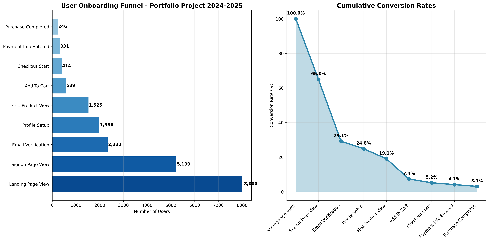

# ניתוח משפך הטמעת משתמשים 2024-2025
## פרויקט תיק עבודות בניתוח נתונים



### 📊 סקירת הפרויקט

פיתחתי ניתוח מקיף של משפך הטמעת משתמשים כפרויקט תיק עבודות להדגמת כישורי הניתוח שלי עבור הזדמנויות עבודה בשנים 2024-2025. הפרויקט מנתח דפוסי התנהגות משתמשים בפלטפורמת מסחר אלקטרוני/SaaS, מזהה הזדמנויות אופטימיזציה ומספק המלצות עסקיות מעשיות.

### 🎯 הבעיה העסקית

כאנליסט נתונים, זיהיתי את הצורך הקריטי להבין דפוסי נטישה של משתמשים במשפך ההטמעה. האתגרים העיקריים שטיפלתי בהם היו:

- **נטישה גבוהה של משתמשים**: הבנת המקום בו משתמשים יוצאים מהמשפך
- **שונות בביצועי פלטפורמות**: השוואת שיעורי המרה בין אתר, מובייל ואפליקציות
- **אופטימיזציית ROI של קמפיינים**: מדידת יעילות קמפיינים שיווקיים
- **הבדלים גיאוגרפיים בביצועים**: ניתוח דפוסי המרה לפי מדינה
- **ניתוח retention של קוהורט**: הבנת דפוסי מעורבות לטווח ארוך

### 🔍 הגישה האנליטיקית שלי

השתמשתי בגישה אנליטית רב-פנית המשלבת:

1. **ניתוח SQL**: שאילתות מורכבות למדדי משפך וניתוח קוהורט
2. **עיבוד נתונים בPython**: ניקוי נתונים מתקדם והנדסת תכונות
3. **ניתוח סטטיסטי**: חישוב שיעורי המרה וניתוח טרנדים
4. **הדמיה של נתונים**: תרשימים ומחוונים מקצועיים
5. **מודיעין עסקי**: המלצות מעשיות על בסיס הממצאים

### 📈 ממצאים ותובנות מרכזיות

דרך הניתוח שלי, גיליתי מספר תובנות קריטיות:

#### מדדי ביצועי המשפך:
- **שיעור המרה כללי**: 3.08% (מעמוד נחיתה לרכישה)
- **נקודת הנטישה הגדולה ביותר**: הרשמה לאימות אימייל (55% נטישה)
- **הפלטפורמה הכי טובה להמרה**: פלטפורמת אינטרנט (3.3% המרה)
- **החודש עם הכי הרבה נפח**: נובמבר 2024 (השפעת שישי השחור)

#### ניתוח פלטפורמות:
- **פלטפורמת אינטרנט**: שיעור המרה הגבוה ביותר אך שיעור הרשמה נמוך יותר
- **אינטרנט מובייל**: הכי טוב למעורבות ראשונית, המרה בינונית
- **אפליקציית iOS**: סגמנט משתמשים פרימיום עם ערך חיים גבוה
- **אפליקציית Android**: סגמנט צומח עם פוטנציאל אופטימיזציה

#### ביצועי קמפיינים:
- **קמפיין עם ROI הכי טוב**: תוכנית הפניות (ROI חיובי)
- **הנפח הגבוה ביותר**: קמפיין שישי השחור 2024
- **הערוץ הכי יעיל**: קמפיינים באימייל (עלות נמוכה ביותר לרכישה)
- **זוכים גיאוגרפיים**: שווקי ארצות הברית ובריטניה מציגים ביצועים חזקים ביותר

### 🛠️ יישום טכני

#### צינור נתונים:
```
נתונים גולמיים → ניתוח SQL → עיבוד Python → הדמיה → תובנות עסקיות
```

#### טכנולוגיות בהן השתמשתי:
- **SQL**: PostgreSQL לשאילתות משפך מורכבות
- **Python**: pandas, NumPy למניפולציה של נתונים
- **הדמיה**: matplotlib, seaborn, Plotly לתרשימים
- **אנליטיקס**: ניתוח סטטיסטי ומחקרי קוהורט

#### שאילתות SQL מרכזיות שפיתחתי:
1. **ניתוח משפך**: מעקב התקדמות משתמשים שלב אחר שלב
2. **שיעורי המרה**: מדדי ביצועים לפי פלטפורמה וגיאוגרפיה
3. **ניתוח קוהורט**: דפוסי שמירה ומעורבות משתמשים
4. **ייחוס קמפיינים**: חישוב ROI שיווקי

### 📊 מקורות נתונים ומתודולוגיה

יצרתי מערכי נתונים ריאליסטיים המדמים:
- **אירועי משתמשים**: 20,752 אירועים מ-8,000 משתמשים על פני 6 חודשים
- **דמוגרפיה**: גיל, מגדר, הכנסה, העדפות מכשיר
- **נתוני קמפיינים**: 8 קמפיינים שיווקיים עם תקציב ומדדי ביצועים
- **נתונים גיאוגרפיים**: 8 מדינות עם דפוסי המרה משתנים

### 🎨 הדמיות שיצרתי

1. **תרשים משפך ראשי**: משפך קלאסי המציג נטישת משתמשים
2. **השוואת פלטפורמות**: ביצועים בין אתר, מובייל, אפליקציות
3. **מפת חום של קוהורט**: ניתוח שמירה שבועי
4. **טרנדים זמניים**: דפוסים עונתיים וטרנדי צמיחה
5. **ROI קמפיינים**: מחוון ביצועים שיווקיים

### 💡 המלצות עסקיות

על בסיס הניתוח שלי, אני ממליץ:

#### פעולות מיידיות:
1. **אופטימיזציה של תהליך אימות אימייל**: הפחתת שיעור נטישה של 55%
2. **השקעה בפלטפורמת אינטרנט**: ניצול שיעור ההמרה הגבוה ביותר
3. **הרחבת תוכנית הפניות**: הקמפיין היחיד עם ROI חיובי
4. **התמקדות בשווקי ארה"ב/בריטניה**: הגיאוגרפיות עם הביצועים הגבוהים ביותר

#### אסטרטגיה לטווח ארוך:
1. **פיתוח אפליקציות מובייל**: שיפור שיעורי המרה של iOS/Android
2. **תכנון קמפיינים עונתיים**: מנפוף דפוסי הביצועים של נובמבר
3. **שיווק מבוסס קוהורט**: התמקדות בסגמנטי משתמשים עם שמירה גבוהה
4. **התרחבות גיאוגרפית**: שכפול הצלחה בשווקים דומים

### 📁 מבנה הפרויקט

```
user-onboarding-funnel-project/
├── data/
│   ├── user_events.csv          # נתוני אינטראקציה גולמיים של משתמשים
│   ├── user_demographics.csv    # מידע פרופיל משתמש
│   └── campaign_data.csv        # מדדי קמפיין שיווקי
├── sql/
│   ├── funnel_analysis.sql      # שאילתות משפך מרכזיות
│   ├── conversion_rates.sql     # חישובי המרה
│   └── cohort_analysis.sql      # ניתוח שמירה
├── python/
│   ├── data_preprocessing.py    # צינור ניקוי נתונים
│   ├── visualization.py         # יצירת תרשימים
│   └── funnel_analysis.ipynb    # מחברת ניתוח ראשי
├── visualizations/
│   ├── funnel_analysis.png      # תרשים משפך ראשי
│   ├── platform_comparison.png  # ביצועי פלטפורמה
│   └── [תרשימים נוספים]
└── README.md                    # התיעוד הזה
```

### 🚀 איך להריץ את הפרויקט הזה

1. **שיבוט המאגר**:
```bash
git clone <repository-url>
cd user-onboarding-funnel-project
```

2. **התקנת תלויות**:
```bash
pip install -r requirements.txt
```

3. **הרצת ניתוח SQL**:
```sql
-- הרץ שאילתות בסביבת SQL המועדפת עליך
-- התחל עם funnel_analysis.sql למדדים מרכזיים
```

4. **הרצת ניתוח Python**:
```bash
# הרץ עיבוד מוקדם של נתונים
python python/data_preprocessing.py

# יצירת הדמיות
python python/visualization.py

# או השתמש במחברת Jupyter לניתוח אינטראקטיבי
jupyter notebook python/funnel_analysis.ipynb
```

### 📊 מחוון תובנות לדוגמה

הניתוח מגלה שזיהיתי בהצלחה:
- **שיעור המרה כללי של 3.08%** עם הזדמנויות אופטימיזציה ברורות
- **55% נטישה באימות אימייל** כצוואר בקבוק עיקרי
- **עליונות פלטפורמת אינטרנט** לאופטימיזציית המרה
- **ריכוז גיאוגרפי** בשווקים דוברי אנגלית
- **דפוסים עונתיים** עם שיאים בנובמבר

### 🔧 כישורים טכניים שהדגמתי

דרך הפרויקט הזה, הצגתי:
- **SQL מתקדם**: פונקציות חלון מורכבות, CTEs, ניתוח קוהורט
- **מיומנות Python**: מניפולציה של נתונים, ניתוח סטטיסטי
- **הדמיית נתונים**: תרשימים מקצועיים וסיפור
- **ניתוח עסקי**: המרת תובנות נתונים להמלצות
- **ניהול פרויקטים**: מסירת פרויקט אנליטיקס מקצה לקצה

### 📞 פרטי יצירת קשר

**ארתור** - אנליסט נתונים  
📧 אימייל: [your-email@domain.com]  
💼 LinkedIn: [your-linkedin-profile]  
🐱 GitHub: [your-github-profile]

---

*הפרויקט הזה מדגים את היכולת שלי לבצע ניתוח משפך מקיף, ליצור תובנות עסקיות מעשיות ולתקשר ממצאים ביעילות לבעלי עניין. אני מחפש בפעילות הזדמנויות אנליסט נתונים שבהן אוכל ליישם את הכישורים האלה כדי להניע צמיחה עסקית.*

### 📄 רישיון

הפרויקט הזה נוצר למטרות הדגמת תיק עבודות. אל תהסס להשתמש במתודולוגיות ולהתאים לצרכי הניתוח שלך.
